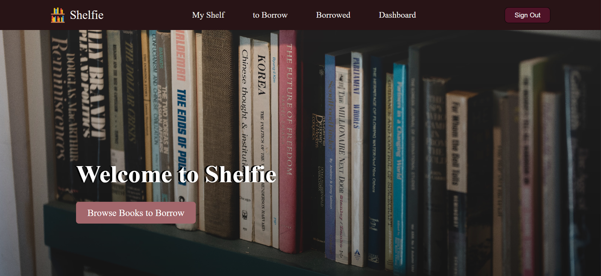

# 📚 Shelfie

_A full-stack book tracking and lending app_



## Getting Started

### Try the App
[Deployed App](https://shelfie-cv4a.onrender.com)

### How to Use
1. Sign up for an account, or sign in if you already have one
2. Add books to **My Shelf** and track their reading status (Want to Read, Currently Reading, Read, DNF)
3. Mark a book as borrowable so other users can request to borrow it
4. Browse the **To Borrow** page to find books other users have made available
5. Request to borrow a book — the owner will see it on their **Dashboard** and can accept or reject it
6. Once accepted, the book shows up under **Borrowed**, where you can return it when you're done

### Installation
Clone the repo, install dependencies, and set up your environment variables to run it locally.

```
git clone https://github.com/Hawra-14/shelfie.git
cd shelfie
npm install
```

Create a `.env` file in the project root:
```
MONGODB_URI=
SESSION_SECRET=
```

Then run the app:
```
nodemon server.js
```

Visit `http://localhost:3000` in your browser.

### Technologies Used
- **Node.js & Express**: For the server and routing
- **MongoDB & Mongoose**: For the database and data modeling
- **EJS**: For server-side templating
- **HTML & CSS**: For structuring and styling the interface
- **Express Session**: For authentication and session management

### Future Enhancements
- Notifications when a borrow request is accepted or rejected
- Search and filter books by genre, title, or author
- Wishlist ("Wish to Borrow") for books not currently available
- Borrow history view for both owners and borrowers

### Credits
- [MDN Web Docs](https://developer.mozilla.org): for JavaScript and CSS references
- [Mongoose Docs](https://mongoosejs.com/docs/): for schema and model references
- [W3Schools](https://www.w3schools.com/): for quick references and examples

### Contributing

Feel free to fork this repository and submit pull requests to contribute to the development of Shelfie. For major changes, please open an issue first to discuss what you would like to change.
